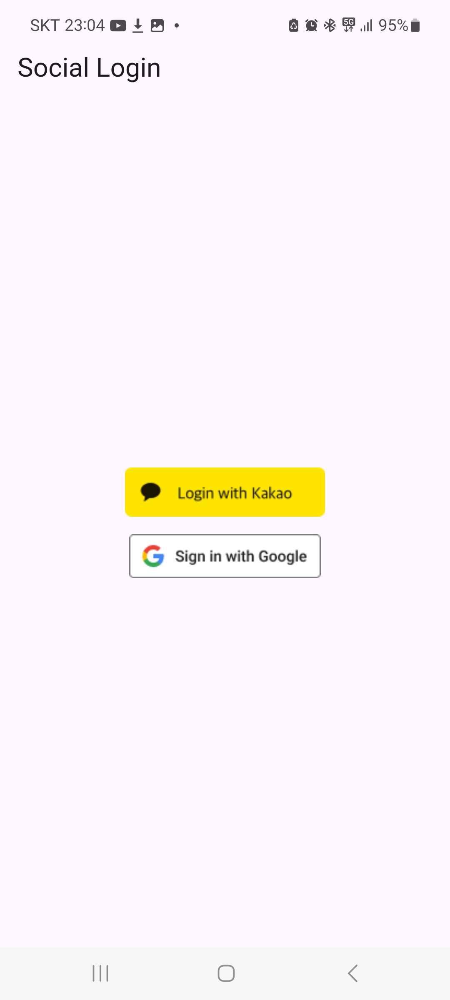
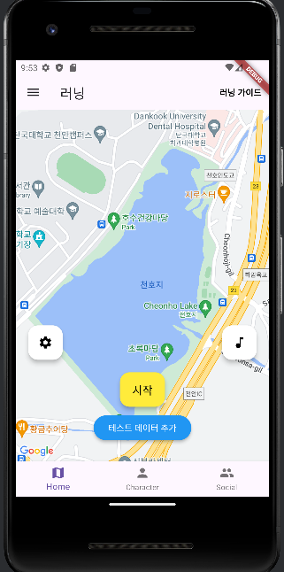
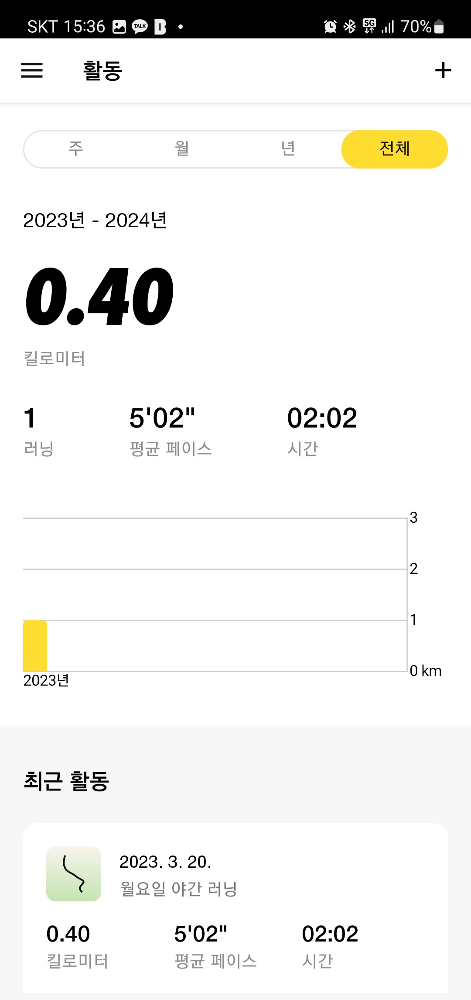
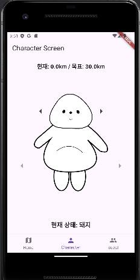
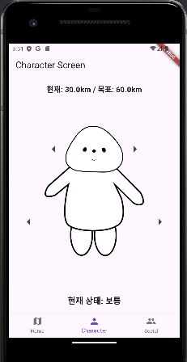
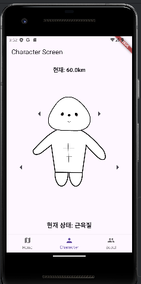

<div align="center">
  <h1>🏃 러닝 앱 (Flutter 기반)</h1>
  <p>Google & Kakao 로그인 + 러닝 기록 저장 + 프로필 관리 기능을 포함한 심플 러닝 앱</p>

  
  
  
  
</div>

---

## 🗂️ 프로젝트 구조

```
lib/
├── main.dart                    # 앱 진입점
├── firebase_options.dart        # Firebase 초기화 설정
├── controllers/
│   └── user_controller.dart     # 사용자 정보 상태관리
├── models/
│   └── running_record.dart      # 러닝 기록 모델 정의
├── services/
│   ├── firebase_record.dart     # Firebase Firestore 업로드 로직
│   ├── google_sign_in_api.dart  # 구글 로그인 로직
│   └── kakao_login_api.dart     # 카카오 로그인 로직
├── screen/
│   ├── login_screen.dart        # 로그인 화면
│   ├── main_screen.dart         # 메인 탭 화면
│   ├── running_screen.dart      # 러닝 기록 측정 화면
│   ├── plan_screen.dart         # 러닝 계획/목표 화면
│   ├── profile_input_screen.dart# 프로필 입력 화면
│   ├── homescreen.dart          # 홈 화면
│   ├── activity_screen.dart     # 활동/운동 요약 화면
│   ├── characterscreen.dart     # 캐릭터 화면 (게임화 요소 추정)
│   ├── socialscreen.dart        # 소셜 화면
│   └── app.dart                 # MaterialApp 라우팅 정의
└── widgets/
    └── stats_summary_widget.dart # 통계 요약 위젯
```

---

## 🚀 주요 기능

| 기능                 | 설명                                         |
| ------------------ | ------------------------------------------ |
| 🔐 **소셜 로그인**      | Google 및 Kakao 로그인을 통한 간편 로그인 지원           |
| 🏃 **러닝 기록 저장**    | 거리, 시간 등 기록 측정 후 Firebase Firestore에 업로드   |
| 📊 **운동 통계 요약**    | 위젯 형태로 요약 표시 (`stats_summary_widget.dart`) |
| 👤 **프로필 입력 기능**   | 사용자 성별, 나이 등 입력 가능                         |
| 🧑‍🤝‍🧑 **소셜 기능** | 캐릭터, 친구, 공유 요소 탑재 예상                       |
| 🔥 **Firebase 연동** | Firestore + Auth 기반 기능 구현                  |

---

## 🛠 사용 기술 (Skills)

<div>
  
  
  
  
  
</div>

---

## 📸 앱 화면 예시 










---

## 🛠 실행 방법

1. Firebase 프로젝트 연동 후 `firebase_options.dart` 생성
2. Kakao Developers 콘솔에서 앱키 세팅
3. `.env` 또는 `google-services.json`, `GoogleService-Info.plist` 설정
4. Flutter 패키지 설치 후 실행

```bash
flutter pub get
flutter run
```

---

## 🙌 개발자

* 김인호 외 3명러닝 앱 프로젝트 팀
* 본 앱은 데모/학습용 프로젝트로, 기능 확장 및 디자인 개선 예정입니다.
